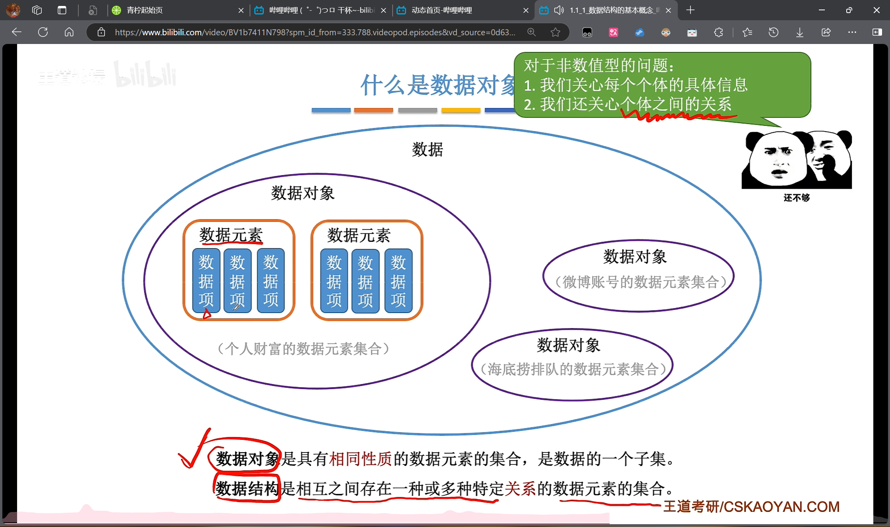

# 数据结构

## 一、绪论

### （一）数据结构的基本概念

#### 数据

> 数是信息的载体，是描述客观事物属性的数、字符及所有能输入到计算机中并被计算机程序识别和处理的符号的集合。
> 数据是计算机程序加工的原料。

#### 数据元素

> 数据元素使数据的基本单元，通常作为一个整体进行考虑和处理。

#### 数据项

> 一个数据元素可由若干数据项组成，数据项是构成数据元素的不可分割的最小单位。

#### 数据对象&数据结构

> 同样的数据元素可以组成不同的数据结构；
> 不同的数据元素也可组成同样的数据结构。
> 数据结构这门课着重关注的是**数据元素之间的关系，和对这些数据元素的操作**，而不关心具体的数据项内容。

### （二）数据结构三要素

#### 逻辑结构

##### 集合结构

> 各个元素同属一个集合，别无其他关系。

##### 线性结构

> 数据元素之间是一对一的关系。
> 除了第一个元素，所有元素都有唯一**前驱**。
> 除了最后一个元素，所有元素都有唯一**后继**。

##### 树形结构

> 数据元素之间是一对多的关系。

##### 图状结构

> 数据元素之间是多对多的关系。

#### 数据的运算

> 针对于某种逻辑结构，结合实际需求，定义**基本运算**。

#### 物理结构（存储结构）

> 如何用计算机表示数据元素的逻辑关系

##### 顺序存储

> 把逻辑上相邻的元素存储在物理位置上也相邻的存储单元中。
> 元素之间的关系有存储单元的邻接关系来体现。

##### 链式存储

> 逻辑上相邻的元素在物理位置上可以不相邻。
> 借助指示元素储存地址的指针来表示元素之间的逻辑关系。

##### 索引存储

> 在存储元素信息的同时，还建立附加索引表。
> 索引表中的每一项称为索引项，一般形式：（关键字， 地址）。

##### 散列存储

> 根据元素的关键字直接计算出该元素的存储地址，又称为哈希（Hash）存储。

