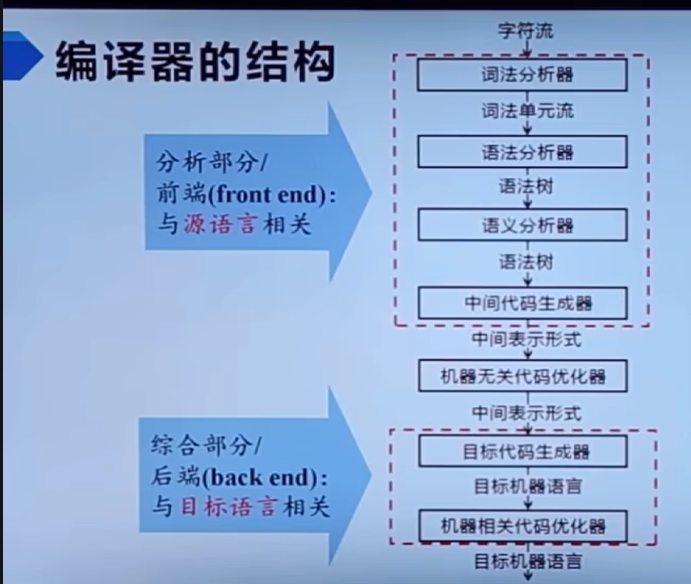

# 编译原理

```mermaid!
graph TD;
	高级语言-->编译; 编译-->汇编语言
	汇编语言-->汇编; 汇编-->机器语言
	编译-->机器语言
```

编译：将高级语言（源语言）翻译成汇编语言或机器语言（目标语言）的过程。

## 编译器在语言处理系统中的位置

## 编译器结构

## 词法分析

### 主要任务

从左向右逐行扫描源程序字符，识别出各个单词，确定单词类型。将识别的单词转换成统一的机内表示——词法单元形式（token）。
> token：<种别码, 属性值>

## 语法分析

### 主要任务

从词法分析得到的token序列中识别出各类短语，并构造语法分析树(parse tree)。

## 语义分析

### 主要任务

声明语句 可执行语句
收集标识符属性信息
> 种属（kind）、类型（type）、存储位置、长度、值、作用域、参数、返回值信息

语义检查

## 中间代码生成和编译器后端

三地址码
